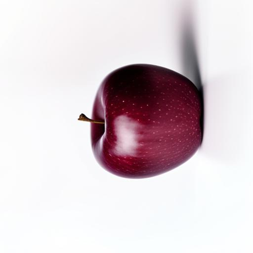
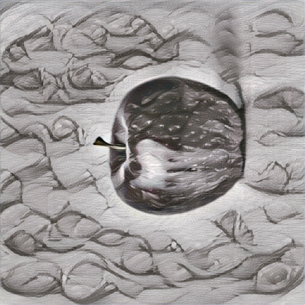
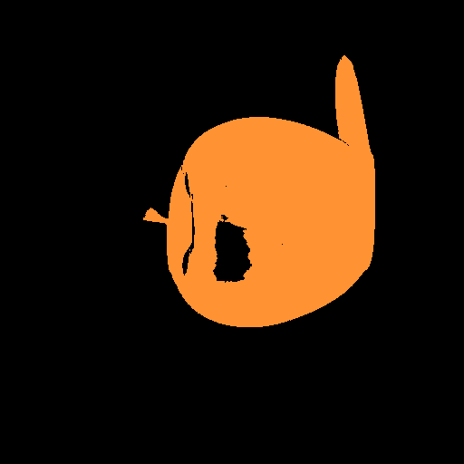
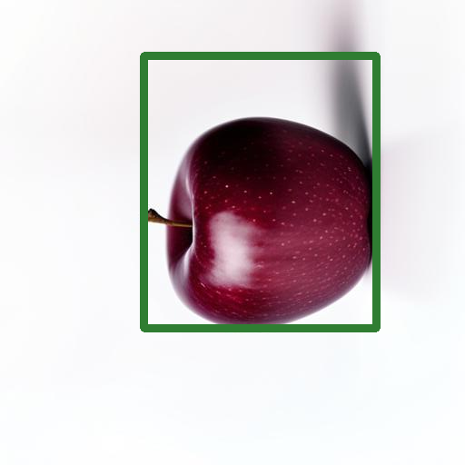

В данном репозитории содержится исходный код и ресурсы необходимые для запуска программного обеспечения,
реализующего процесс создания обучающей выборки для нейронных сетей сегментации и детекции объектов.

Проект содержит:
1) Папку application, в которой находятся:
	- файл main.py - содержит исходный код программы;
	- папка sources - содержит 10 изображений для стилизации и базовые фоны для объединения классов (белый и чёрный);
	- папка backgrounds - содержит набор из 3333 фонов разного цвета для объединения классов, сгенерированых с помощью нейронной сети;
	- папка images, в которую записываются изображения по классам. Пример сгенерированного, стилизованного и размеченного изображения для класса "яблоко":

		 
		
		
  
  	- папка flowers - содержит набор изображений размеченных в ручную (применяется в эксперименте 4);
   	- папка join_classes - содержит набор с 3 объединёнными классами, созданный с помощью ПО (применяется в эксперименте 4);
   	- папка backs - содержит набор фонов, который применялся для объединения классов в join_classes.

Интерфейс программного обеспечения:

